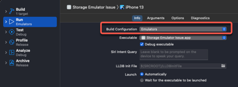

# Storage-Emulator-Issue
Minimal Reproducable Example (MCVE) for issue with Firebase Storage rules on the Emulator Suite

This example demonstrates how the storage.rules with any condition like allow read, write: if request.auth!=null will force the emulator suite to terminate.

## How to Reproduce

### Create The Firebase Project 

1. Create the Firebase Project
2. Add an **iOS App** using the iOS BundleID for your copy of the included source code and register
3. Download the GoogleServices-Info.plist file and replace the one included with this repo
4. Enable Email/Password Authentication
5. Set up Cloud Storage and accept the default rules

`````swift
service firebase.storage {
  match /b/{bucket}/o {
    match /{allPaths=**} {
      allow read, write: if request.auth != null;
    }
  }
}
`````

### Running the Application

> **Note:** Make sure that the build configuration is set to DEBUG


1. Create a New account

   If the account is succesfully created you will be logged in

2. Choose an image for the profile

3. Log Out

4. Log back in using the same credentials

   The stored image should be displayed as the profile image


### Install the Firebase Emulator Suite

1. Install the Firebase Emulator Suite and make sure that you setup Authentication and Storage Emulators

`````swift
=== Emulators Setup
? Which Firebase emulators do you want to set up? Press Space to select emulator
s, then Enter to confirm your choices. 
 ◉ Authentication Emulator
 ◯ Functions Emulator
 ◯ Firestore Emulator
 ◯ Database Emulator
 ◯ Hosting Emulator
 ◯ Pub/Sub Emulator
❯◉ Storage Emulator
`````

2. When initializing Storage, make sure you download the Storage.rule and confirm that the rules are identical to the ones on the server.
3. Start the emulators and verify that both authentication and storage emulators are running

#### Run the App using the Emulators configuration

1. Open the application in Xcode again but before running, change the build configuration to use the **Emulators** configuration.



2. Repeat the process as for steps 1-4 above for running the application

   You will find that you are able to create an account (you can verify this).  However, when you try to add a profile image and have it stored on the server, the **emulators will crash**.

#### Edit Storage.rules

1. Open the simulator's version of **storage.rules** and edit it to remove the condition for read, write

`````swift
rules_version = '2';
service firebase.storage {
  match /b/{bucket}/o {
    match /{allPaths=**} {
      allow read, write;
    }
  }
}
`````

3. Restart the emulators with the new storage rules in place.
4. Repeat the steps for creating an account and confirm that you are now able to upload an image to storage.

